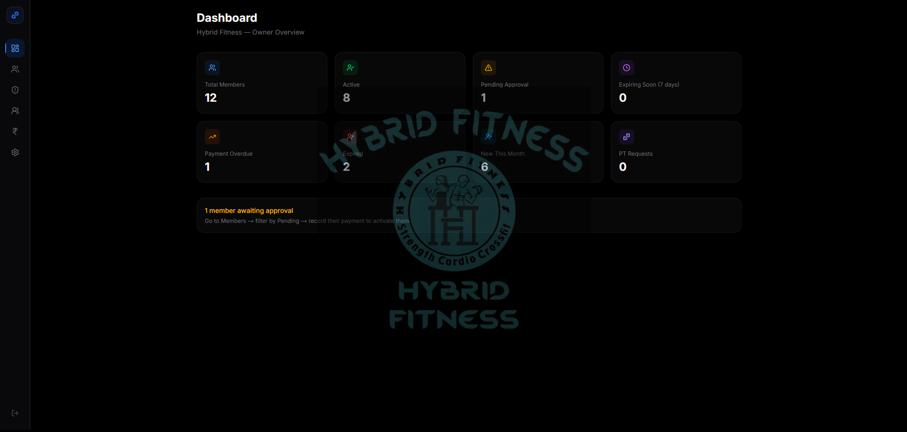
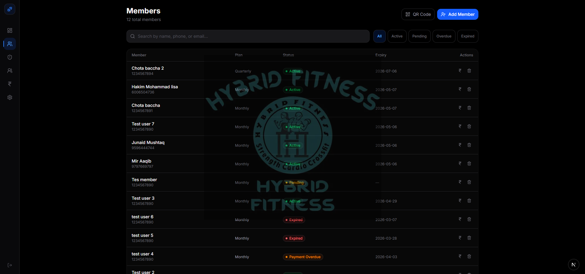
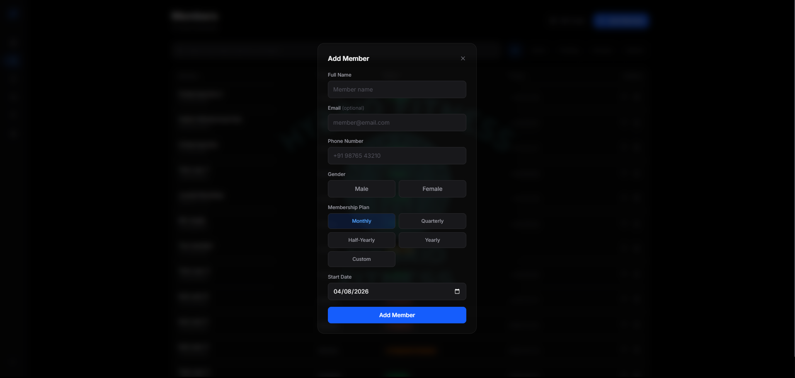
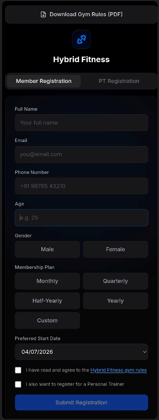
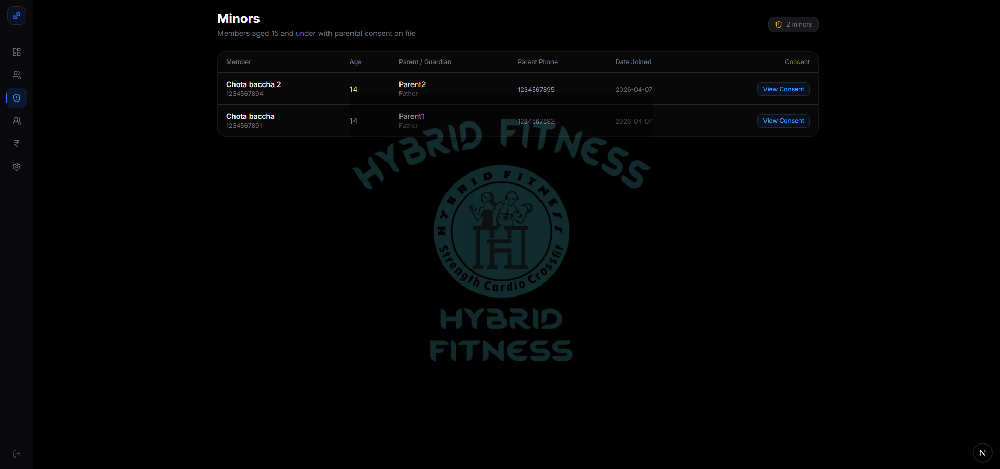
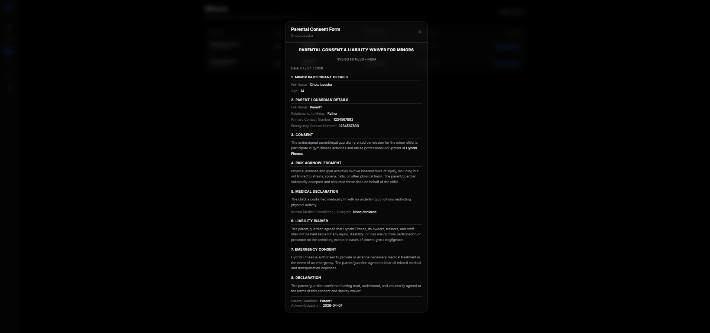
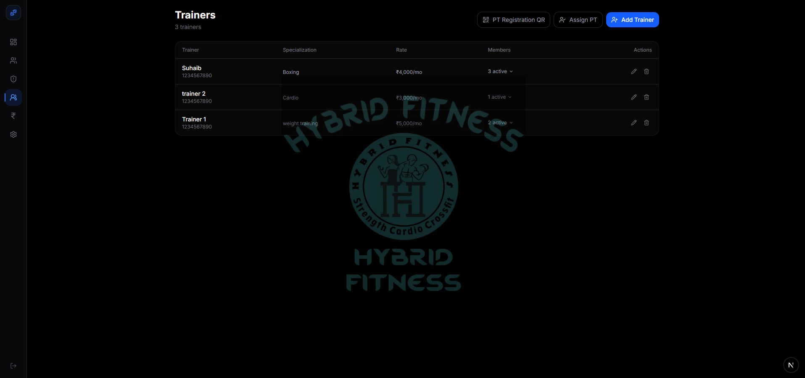
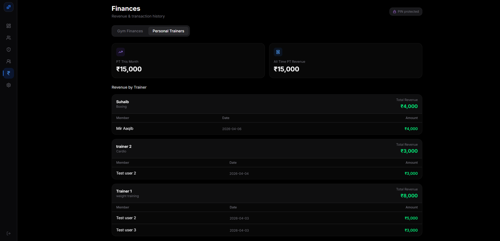
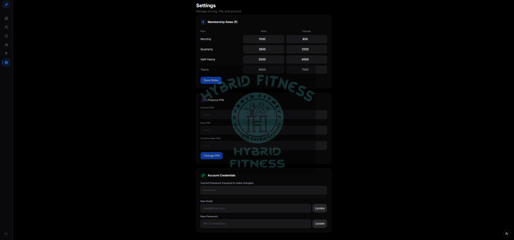

# GymTrack — Hybrid Fitness Management System

A full-stack gym management web app built for **Hybrid Fitness**. Gives the gym owner a complete operational dashboard — member management, trainer assignments, financial tracking, minor member compliance, and automated SMS notifications — all from one place.

**Stack:** Next.js · Firebase Firestore · Firebase Cloud Functions · Tailwind CSS · TypeScript · Vercel

---

## Table of Contents

1. [Demo Video](#1-demo-video)
2. [Dashboard](#2-dashboard)
3. [Member Management](#3-member-management)
4. [QR Code Self-Registration](#4-qr-code-self-registration)
5. [Minor Members & Parental Consent](#5-minor-members--parental-consent)
6. [Trainers & Personal Training](#6-trainers--personal-training)
7. [Finances](#7-finances)
8. [Automated SMS Notifications](#8-automated-sms-notifications)
9. [Settings](#9-settings)
10. [Tech Stack](#10-tech-stack)
11. [Project Structure](#11-project-structure)

---

## 1. Demo Video

<video src="screenshots-for-github/Gym Track Demo Video.mp4" controls width="100%"></video>

---

## 2. Dashboard



The owner's home screen gives a real-time snapshot of the entire gym at a glance. Eight stat cards update live from Firestore:

| Card | Description |
|---|---|
| **Total Members** | All registered members across every status |
| **Active** | Members with a live, unexpired membership |
| **Pending Approval** | Members who registered via QR and await activation |
| **Expiring Soon** | Members whose membership expires within 7 days |
| **Payment Overdue** | Members inside the 5-day grace period after expiry |
| **Expired** | Fully lapsed memberships |
| **New This Month** | Registrations in the current calendar month |
| **PT Requests** | Pending personal trainer assignment requests |

An amber alert banner appears at the bottom whenever members are awaiting approval, with a direct instruction to navigate to Members → filter Pending → record their payment to activate them.

---

## 3. Member Management



A full roster of every member with live status badges and per-row quick actions.

**Search & Filter**
- Search across name, phone, and email simultaneously
- Filter by status: **All · Active · Pending · Overdue · Expired**

**Per-row actions**
- **Record Payment** — renews the membership and recalculates the expiry date automatically based on the selected plan and start date
- **Edit** — update any member detail
- **Delete** — permanently remove the member record

**Adding members manually**



The owner can manually add a member via a slide-up modal — full name, email, phone, gender, membership plan, and preferred start date.

**Membership plans**

| Plan | Duration |
|---|---|
| Monthly | 30 days |
| Quarterly | 90 days |
| Half-Yearly | 180 days |
| Yearly | 365 days |
| Custom | Any number of days — price confirmed by the owner |

**Membership status lifecycle**

```
Pending  →  Active  →  Overdue (5-day grace)  →  Expired
```

> Overdue members retain access during the 5-day grace window. Status updates automatically every day via the Cloud Function.

---

## 4. QR Code Self-Registration



The public `/register` page lets new members sign up themselves by scanning a QR code — no owner involvement needed at sign-up time. The page has two tabs.

### Member Registration tab

Fields collected: Full Name · Email · Phone Number · Age · Gender · Membership Plan · Preferred Start Date

- **Duplicate check** — if the phone number or email already exists in the system, the form is blocked with a message directing the person to use the PT tab instead
- **Gym rules** — a PDF download button sits at the top; a mandatory checkbox requires the member to confirm they have read and agreed to the official gym rules before the form can be submitted
- **PT opt-in** — a checkbox at the bottom lets the member indicate they also want a personal trainer; ticking it automatically switches to the PT Registration tab after a successful submission
- **Success screen** — displays a confirmation message, a PDF download button, and a full scrollable copy of the official gym policies

### PT Registration tab

Fields: Name · Phone Number · Trainer selection

- **Duplicate check** — if a pending or active PT request already exists with the selected trainer, the submission is blocked; registering with a different trainer is allowed freely
- Success screen confirms the request has been received and is under review

All submissions are stored in Firestore as `pending` — the owner reviews and activates them from the Members or Trainers tab.

---

## 5. Minor Members & Parental Consent



A dedicated **Minors** tab in the sidebar lists all *active* members aged 15 and under, along with their parental consent information on a single screen.

Columns: Member name · Age · Parent / Guardian · Relationship · Parent Phone · Date Joined · Consent

Each row has a **View Consent** button that opens the full formatted legal document:



The **Parental Consent & Liability Waiver** modal shows:

1. Minor Participant Details
2. Parent / Guardian Details (name, relationship, primary phone, emergency phone)
3. Consent declaration
4. Risk Acknowledgment
5. Medical Declaration — including any declared conditions or allergies
6. Liability Waiver
7. Emergency Medical Consent
8. Declaration and acknowledgement date

### How consent is collected

When a registering member enters an age of 15 or below, a consent section automatically expands on the registration form. It contains:

- A scrollable card with the complete legal text of the waiver
- Fillable fields at the bottom of the scroll: parent/guardian full name, relationship, primary contact, emergency contact, and known medical conditions or allergies
- A consent checkbox that is **disabled until the parent has scrolled to the very bottom** of the document

All consent data is stored in Firestore against the member record and is accessible from the Minors tab at any time.

---

## 6. Trainers & Personal Training



Manage the gym's personal trainer roster and all PT client assignments from a single page.

**Trainer management**
- Add a trainer — name, phone, specialization, monthly rate
- Edit or delete any trainer record
- Each trainer row shows their current active member count, expandable to reveal individual assigned members with expiry dates and a one-click unassign button

**PT assignments**
- **Assign PT** — the owner can directly assign any existing member to any trainer from the dashboard
- **PT Registration QR** — a separate QR code leads members to a standalone `/pt-register` page where they can request a trainer themselves
- **Approve PT request** — pending requests appear in an amber panel at the top of the page; the approve modal pre-fills the fee with the trainer's monthly rate (editable before confirming)

**PT request lifecycle**

```
Pending  →  Active (owner approves & sets fee)  →  Unassigned (auto-expires after 30 days)
```

---

## 7. Finances

### PIN Protection


The entire Finances section sits behind a 4-digit PIN. Financial data remains blurred until the correct PIN is entered. The PIN is set and changed from Settings.

### Gym Finances tab


- **Selected Period** card — total revenue within the active date range and gender filter
- **Total Revenue** card — all-time cumulative gym revenue, always unfiltered regardless of filters
- **Monthly Revenue chart** — visual income trend across months
- **Gender filter** — All / Male / Female toggle to segment revenue and the transaction table
- **Date range filter** — From / To date inputs, defaulting to the first and last day of the current month
- **Transaction history** — member name · plan · date · note · amount

### Personal Trainers tab



- **PT This Month** and **All Time PT Revenue** summary cards
- **Revenue by Trainer** — each trainer has their own collapsible section showing total earned and a line-by-line member payment breakdown
- **PT transaction history** — full chronological list of all PT payments across all trainers

---

## 8. Automated SMS Notifications

Firebase Cloud Functions run a **daily scheduled job** that updates membership statuses and sends SMS messages via **MSG91** at three key moments in the membership lifecycle:

| Trigger | SMS sent |
|---|---|
| 3 days before expiry | *"…your membership expires in 3 days. Please visit us to renew. Please ignore if you have already paid."* |
| Day of expiry | *"…your membership expires today. Please visit us to renew. Please ignore if you have already paid."* |
| 1 day after expiry | *"…your membership expired yesterday. You have a grace period to renew. Please visit us soon. Please ignore if you have already paid."* |

The same daily job automatically unassigns any PT relationship whose 30-day active period has elapsed.

---

## 9. Settings



**Membership Rates**
Set male and female pricing independently for each plan — Monthly, Quarterly, Half-Yearly, and Yearly. Rates are saved to Firestore and used as the default amount when the owner records a payment.

**Finance PIN**
Set or change the 4-digit PIN protecting the Finances section. A PIN change requires entering the current PIN first.

**Account Credentials**
Update the owner login email or password. Both operations require re-entering the current password for security.

---

## 10. Tech Stack

| Layer | Technology |
|---|---|
| Frontend | Next.js 16 (App Router), Tailwind CSS v4, TypeScript |
| Database | Firebase Firestore |
| Authentication | Firebase Auth (email/password) |
| Scheduled jobs | Firebase Cloud Functions v2 (`onSchedule`) |
| SMS | MSG91 — India transactional SMS |
| Hosting | Vercel |

---

## 11. Project Structure

```
gymtrack/
├── app/
│   ├── dashboard/
│   │   ├── page.tsx              # Owner dashboard — live stat cards
│   │   ├── members/page.tsx      # Member roster, search, filters, payments
│   │   ├── minors/page.tsx       # Minor members & consent document viewer
│   │   ├── trainers/page.tsx     # Trainer roster & PT request management
│   │   ├── finances/page.tsx     # Revenue, charts, filters (PIN-protected)
│   │   └── settings/page.tsx     # Pricing, Finance PIN, account credentials
│   ├── register/page.tsx         # Public QR — member + PT self-registration
│   └── pt-register/page.tsx      # Standalone PT registration QR page
├── components/
│   ├── Sidebar.tsx               # Navigation sidebar with route highlighting
│   ├── PinLock.tsx               # 4-digit PIN overlay component
│   ├── RevenueChart.tsx          # Monthly revenue line chart
│   ├── AddTrainerModal.tsx       # Add / edit trainer modal
│   ├── ApprovePTModal.tsx        # Approve PT request with pre-filled fee
│   ├── AssignPTModal.tsx         # Owner-side manual PT assignment
│   └── RecordPaymentModal.tsx    # Record member payment / renewal
├── lib/
│   ├── members.ts                # Member & payment Firestore operations
│   ├── trainers.ts               # Trainer & PT request Firestore operations
│   ├── types.ts                  # Shared TypeScript interfaces & constants
│   ├── settings.ts               # Settings Firestore operations
│   └── firebase.ts               # Firebase app initialisation
├── public/
│   └── rules.pdf                 # Gym rules PDF — served as static asset
└── functions/
    └── src/index.ts              # Cloud Function — daily SMS & status scheduler
```

---

## 11. License

This project is proprietary software developed exclusively for **Hybrid Fitness**.

All rights reserved. No part of this codebase — including source code, design, logic, or assets — may be copied, modified, distributed, sublicensed, or used in any form without the express written permission of the author.

---

## 12. Author

**Hakim Mohammad Iisa**
Full-Stack Developer

Designed, architected, and built GymTrack from the ground up — covering the owner dashboard, public-facing QR registration flow, real-time Firestore data layer, Firebase Cloud Functions for automated SMS scheduling, and the complete UI in Next.js with Tailwind CSS.

> Built for Hybrid Fitness · India · 2026
