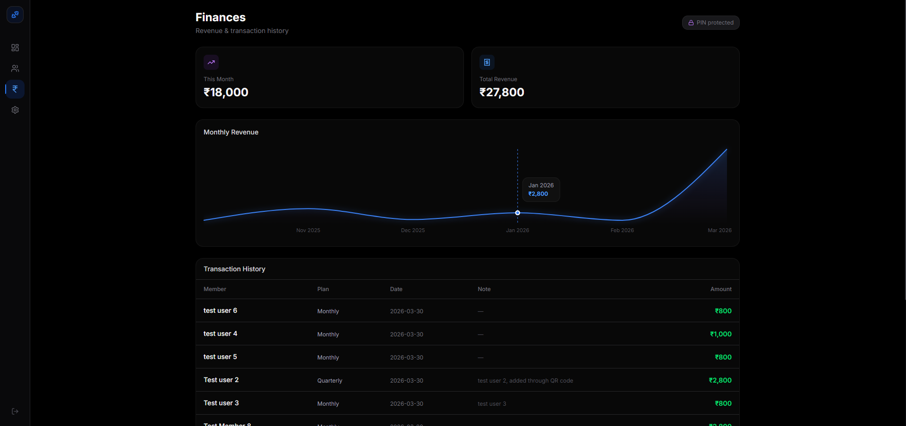

# GymTrack — Owner Edition

A powerful, minimal, and secure gym membership management application built for gym owners. Runs as a native desktop app, mobile app, and web application from a single codebase.

## Features

- **Member Management** — Register members via QR code or manually, track status (Active, Pending, Overdue, Expired)
- **Automated Expiry** — Members automatically transition between statuses based on expiry dates with a 5-day grace period
- **Payment Recording** — Manual payment recording with gender-based pricing and discount support
- **PIN-Protected Finances** — Revenue charts and transaction history locked behind a 4-digit PIN
- **Email Notifications** — Automated reminders 3 days and 1 day before expiry, plus overdue alerts
- **Real-time Sync** — Firebase Firestore keeps desktop and mobile in sync instantly
- **Dark Premium UI** — Deep dark theme with neon accents and glassmorphism cards

## Tech Stack

- **Frontend** — Next.js + Tailwind CSS
- **Database** — Firebase Firestore
- **Auth** — Firebase Auth
- **Email** — Resend
- **Charts** — Recharts
- **Desktop** — Tauri
- **Mobile** — Capacitor

---

## Screenshots

### Dashboard


### Members Tab


### Add Member


### Finance Tab


### Finance Tab — PIN Protected


### Settings Tab


---

## Getting Started

### Prerequisites
- Node.js 18+
- Firebase project (Firestore + Authentication enabled)
- Resend account for email notifications

### Installation

```bash
git clone https://github.com/HakimIisa/Gymtrack-owner.git
cd Gymtrack-owner
npm install
```

Create a `.env.local` file in the root with your Firebase credentials:

```
NEXT_PUBLIC_FIREBASE_API_KEY=your_api_key
NEXT_PUBLIC_FIREBASE_AUTH_DOMAIN=your_auth_domain
NEXT_PUBLIC_FIREBASE_PROJECT_ID=your_project_id
NEXT_PUBLIC_FIREBASE_STORAGE_BUCKET=your_storage_bucket
NEXT_PUBLIC_FIREBASE_MESSAGING_SENDER_ID=your_sender_id
NEXT_PUBLIC_FIREBASE_APP_ID=your_app_id
RESEND_API_KEY=your_resend_api_key
```

```bash
npm run dev
```

Open [http://localhost:3000](http://localhost:3000) to view the app.

---

## Live Demo

Deployed at: [gymtrack-owner.vercel.app](https://gymtrack-owner.vercel.app)

---

*Built with Claude Code — Anthropic*
