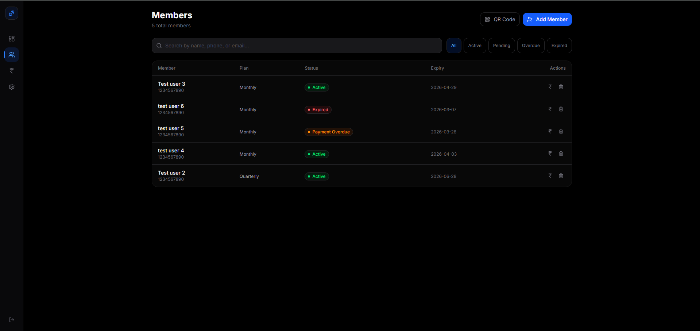
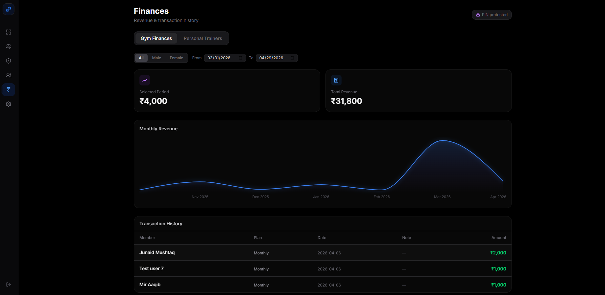
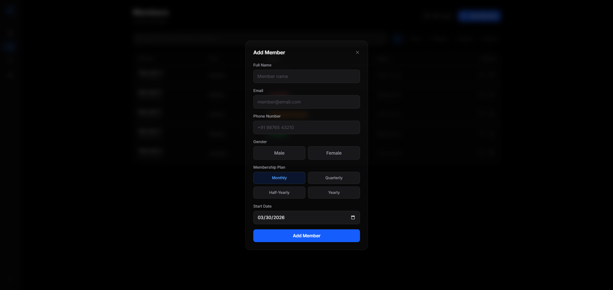
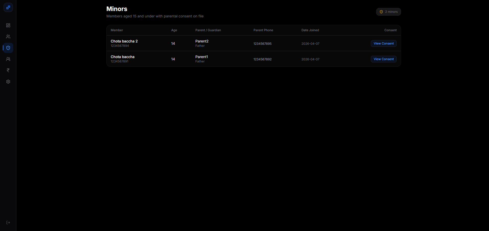
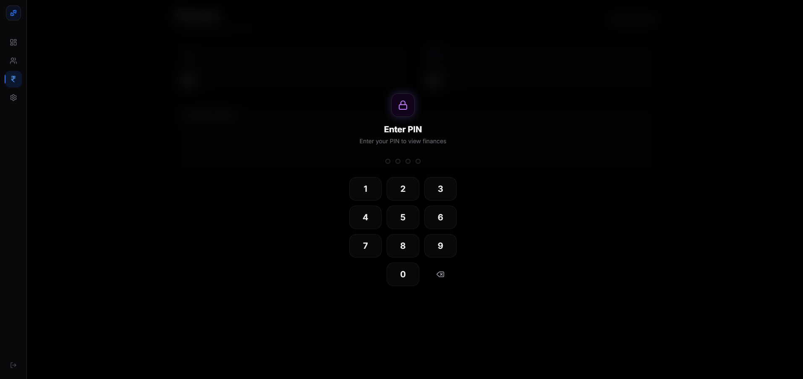
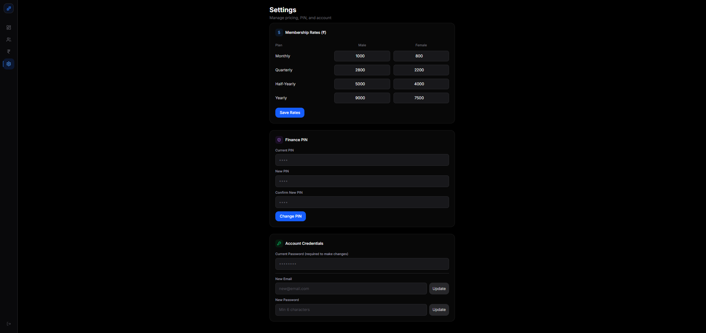

# GymTrack — Hybrid Fitness Management System

A full-stack gym management web app built for **Hybrid Fitness**, designed to give the gym owner a complete operational dashboard — member management, trainer assignments, financial tracking, and automated SMS notifications — all in one place.

Built with **Next.js**, **Firebase Firestore**, **Firebase Cloud Functions**, and **Tailwind CSS**.

---

## Screenshots

### Dashboard


### Members


### Finances


---

## Features

### Owner Dashboard

A real-time overview of the gym's current state at a glance.

- **Total Members** — cumulative count of all registered members
- **Active** — members with a live, unexpired membership
- **Pending Approval** — members who registered via QR code and are awaiting activation
- **Expiring Soon** — members whose membership expires within 7 days
- **Payment Overdue** — members in the 5-day grace period after expiry
- **Expired** — fully lapsed memberships
- **New This Month** — registrations in the current calendar month
- **PT Requests** — pending personal trainer assignment requests

An alert banner appears when members are awaiting approval, with a direct instruction on how to activate them.

---

### Member Management


A full roster of every member with live status badges and quick actions.

- Search members by name, phone, or email
- Filter by status: **All / Active / Pending / Overdue / Expired**
- Each row shows name, contact, membership plan, status badge, expiry date, and action buttons
- **Add Member** — owner can manually register a member via a modal (name, email, phone, gender, plan, start date)
- **Record Payment** — renew a member's subscription; calculates the new expiry date automatically based on plan
- **Edit Member** — update any member details
- **Delete Member** — remove a member from the system



**Membership plans:** Monthly, Quarterly, Half-Yearly, Yearly, and Custom (arbitrary number of days)

**Status lifecycle:** Pending → Active → Overdue (5-day grace) → Expired

---

### QR Code Self-Registration

Members can register themselves by scanning a QR code — no owner involvement needed at sign-up time.


The public `/register` page provides:

- **Two tabs** — Member Registration and PT Registration
- **Member Registration tab**
  - Full Name, Email, Phone Number, Age, Gender, Membership Plan, Preferred Start Date
  - **Duplicate check** — blocks registration if the phone or email already exists in the system, with a prompt to switch to the PT tab instead
  - **Gym rules acknowledgement** — PDF download button at the top; checkbox confirms the member has read and agreed to the rules before submitting
  - **PT opt-in checkbox** — if checked, automatically switches to the PT Registration tab after a successful member submission
  - On success: a scrollable card with all official gym rules is shown, along with a PDF download button
- **PT Registration tab**
  - Name, phone, and trainer selection
  - **Duplicate check** — blocks re-registration with the same trainer if an active or pending PT period already exists
  - Registering with a different trainer is freely allowed

All submissions land in Firestore as `pending` — the owner reviews and activates them from the Members tab.

---

### Minor Members (Age 15 and Under)



A dedicated tab lists all active members aged 15 and under, along with their parental consent details.

- Displays: Member name, age, parent/guardian name, relationship, parent phone, and date joined
- **View Consent** button opens a modal with the full formatted **Parental Consent & Liability Waiver**


The consent form is collected at registration time. When a member enters an age of 15 or below on the registration form, a scrollable consent section appears containing:

- Full legal text (consent, risk acknowledgment, medical declaration, liability waiver, emergency consent)
- Fillable fields: parent/guardian name, relationship, primary contact, emergency contact, medical conditions
- A checkbox that only enables after the parent has scrolled to the bottom of the document

All consent data is stored against the member record in Firestore and viewable from the Minors tab at any time.

---

### Trainers & Personal Training


Manage the gym's personal trainer roster and PT client assignments.

- **Add Trainer** — name, phone, specialization, monthly rate
- **Edit / Delete** trainer records
- Each trainer row shows their active member count, expandable to see individual assigned members
- **Assign PT** — owner can manually assign a member to a trainer from the dashboard
- **PT Registration QR** — a separate QR code lets members request a trainer themselves
- PT requests go through an approval flow: Pending → Active (owner sets the fee) → Unassigned (auto-expires after 30 days)
- Members with expiring PT assignments are shown with their expiry date

---

### Finances



The Finances section is protected by a 4-digit PIN to prevent unauthorised access.

#### Gym Finances Tab


- **Selected Period** card — revenue for the currently filtered date range
- **Total Revenue** card — all-time cumulative revenue, always unfiltered
- **Monthly Revenue chart** — visual trend of income over time
- **Gender filter** — toggle between All / Male / Female to segment revenue and transactions
- **Date range filter** — From / To date inputs (default: current month) to narrow the transaction view
- Full transaction history table: member name, plan, date, note, and amount

#### Personal Trainers Tab


- **PT This Month** and **All Time PT Revenue** summary cards
- **Revenue by Trainer** breakdown — each trainer's total with individual payment rows
- Full PT transaction history table

---

### Automated SMS Notifications

Firebase Cloud Functions run a daily scheduled job that sends SMS alerts via MSG91 to members at key points in their membership lifecycle:

| Trigger | Message |
|---|---|
| 3 days before expiry | Membership expires in 3 days. Please visit us to renew. Please ignore if you have already paid. |
| Day of expiry | Membership expires today. Please visit us to renew. Please ignore if you have already paid. |
| 1 day after expiry | Membership expired yesterday. You have a grace period to renew. Please visit us soon. Please ignore if you have already paid. |

The same job also automatically unassigns PT relationships whose 30-day period has elapsed.

---

### Settings



- **Membership Rates** — configure male and female pricing per plan (Monthly, Quarterly, Half-Yearly, Yearly); saved to Firestore and applied at payment recording time
- **Finance PIN** — set or change the 4-digit PIN that protects the Finances section
- **Account Credentials** — update the owner's login email or password (requires current password re-authentication)

---

## Tech Stack

| Layer | Technology |
|---|---|
| Frontend | Next.js (App Router), Tailwind CSS v4, TypeScript |
| Backend / DB | Firebase Firestore |
| Auth | Firebase Authentication |
| Scheduled Jobs | Firebase Cloud Functions v2 (`onSchedule`) |
| SMS | MSG91 (India) |
| Hosting | Vercel |

---

## Project Structure

```
gymtrack/
├── app/
│   ├── dashboard/
│   │   ├── page.tsx              # Owner dashboard
│   │   ├── members/page.tsx      # Member roster & management
│   │   ├── minors/page.tsx       # Minor members & consent viewer
│   │   ├── trainers/page.tsx     # Trainer & PT management
│   │   ├── finances/page.tsx     # Revenue & transactions
│   │   └── settings/page.tsx     # Pricing, PIN, account
│   ├── register/page.tsx         # Public QR member + PT registration
│   └── pt-register/page.tsx      # Standalone PT registration QR
├── components/
│   ├── Sidebar.tsx
│   ├── PinLock.tsx
│   └── RevenueChart.tsx
├── lib/
│   ├── members.ts                # Member & payment Firestore ops
│   ├── trainers.ts               # Trainer & PT request Firestore ops
│   ├── types.ts                  # Shared TypeScript interfaces
│   └── firebase.ts               # Firebase app initialisation
└── functions/src/index.ts        # Cloud Function — daily SMS scheduler
```
